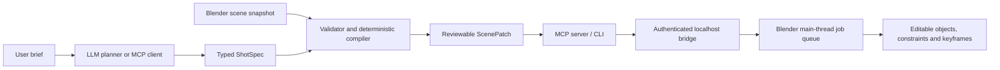

# Architecture

FaceLink separates language understanding from Blender mutation. This is the core product
decision: an LLM is useful for intent and rough staging, but should not own object identity,
threading, undo state or arbitrary code execution.

## Trust boundary

The Blender extension accepts only five operation names: `keyframe_transform`, `look_at`,
`play_clip`, `ensure_camera` and `set_frame_range`. It never accepts Python source or a
generic Blender operator name. The bridge binds to `127.0.0.1`, uses a random bearer token,
limits request bodies to 4 MiB, and routes every `bpy` mutation through a Blender timer on
the main thread.

## Why three layers

1. **Core Python package** owns schemas, validation and deterministic compilation. It is
   testable without Blender or an API key.
2. **Blender extension** owns scene identity and mutation. It has no pip dependencies, so it
   installs cleanly through Blender's extension mechanism.
3. **MCP/CLI sidecar** owns model-provider integrations and process communication. API
   dependencies and credentials never need to be embedded in a `.blend` file.

## Compatibility contract

The extension manifest declares Blender 4.2 as minimum and CI should test 4.2 LTS, 4.5 LTS
and the newest stable 5.x release. The code avoids private Blender APIs. Protocol and schema
versions are explicit so clients can negotiate future changes.

## Known MVP constraints

- Entity transform animation is local-space. Parented rigs need a future world/local-space
  conversion layer.
- `play_clip` requires an existing Blender Action with a matching name; motion generation
  and retargeting are out of scope for v0.1.
- Motion paths are straight-line keyframe interpolation, not navigation-mesh or
  collision-aware planning.
- A camera follow uses Blender constraints and remains artist-editable, but sophisticated
  composition and occlusion solving need a later visual evaluator.

