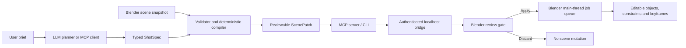

# Architecture

FaceLink separates language understanding from Blender mutation. This is the core product
decision: an LLM is useful for intent and rough staging, but should not own object identity,
threading, undo state or arbitrary code execution.

## Trust boundary

The Blender extension accepts only five operation names: `keyframe_transform`, `look_at`,
`play_clip`, `ensure_camera` and `set_frame_range`. It never accepts Python source or a
generic Blender operator name. The bridge binds to `127.0.0.1`, uses a random bearer token,
limits request bodies to 4 MiB, and routes every `bpy` mutation through a Blender timer on
the main thread.

Successful patches retain up to 50 in-memory FaceLink rollback snapshots. MCP and the Blender
panel use this stack instead of relying on `bpy.ops.ed.undo()`, whose UI-context polling is not
reliable for background or remote bridge jobs. A separate 100-entry audit log is stored on
the Blender Scene and survives `.blend` save/load. Persisted audit entries are never presented
as executable snapshots after a restart.

Rollback history is linear: selecting an older revision restores every newer FaceLink
revision first, followed by the selected revision. Manual edits made after a FaceLink patch
can still be overwritten by its snapshot restore and remain an explicit alpha limitation.

The default v0.2 path has a second safety boundary: the bridge preflights and stages one
patch, Blender displays its operation count, affected objects, frame span and warnings, and
only an explicit apply action mutates the scene. This review gate is provider-independent,
so an MCP client can use its existing model subscription while BYOK users use the CLI.

The v0.2.3 preflight rejects overlapping operations on the same transform/action channel and
FaceLink NLA-strip collisions. Existing editable keyframes are reported as review warnings
instead of hard failures, because overwriting them can be intentional. Staging also builds a
transient GPU overlay from the patch: cyan world-space movement paths and orange predicted
camera frustums. Overlay geometry is kept outside Blender datablocks and is cleared with the
staged patch, so previewing does not dirty or mutate the scene.

Protocol 1.3 adds a deterministic navigation layer before patch generation. Explicitly marked
Blender meshes are triangulated into a compact world-space graph. The core package finds
connected polygon routes with A*, converts shared-edge portals into waypoints, allocates frames
by traveled distance and emits the same whitelisted `keyframe_transform` operation used by
direct motion. Obstacles use a conservative swept-AABB test with actor bounds and clearance.
The complete marked environment has its own fingerprint, preventing new obstacles or mesh
edits from bypassing the earlier entity-scoped scene guard.

Protocol 1.4 adds a non-mutating camera-composition preflight inside Blender. It reuses the
same predicted camera transform as the viewport frustum, projects all eight world-space target
bounds corners into normalized frame coordinates and reports subject size, center offset,
safe-area fit and clipping. A scene ray cast from the predicted camera to the target bounds
center adds an explainable first-occluder warning. Dolly shots are sampled at both endpoints.
The analyzer runs during stage and apply preflight, creates no cameras or render data and puts
the same warnings into the review summary and execution receipt. Target transforms are
evaluated at the camera operation's declared start/end frames, then the user's current timeline
frame and subframe are restored; camera execution uses the same frame contract.

Protocol 1.5 adds bounded rig and Action inventories to Scene Snapshot 1.3. The extension
exports armature bone names, parents and rest-space head/tail coordinates, plus Action frame
ranges, pose-bone channels, data paths and a curve-content fingerprint. The deterministic
compiler checks that a `play_clip` Action exists and that its channels resolve onto the target
rig before it emits a patch. Scene Patch 1.3 carries one source-Action fingerprint per clip;
Blender verifies it at stage and apply so edited or deleted source motion fails closed.

The first adapter is `rename_only`. It copies the source Action, rewrites pose-bone FCurve
paths and group names through an explicit JSON map, and assigns the copy to an ordinary NLA
strip. Its deterministic name makes repeat application idempotent. Rollback restores the NLA
state and removes a FaceLink-created Action when it has no remaining users. This adapter makes
no claim about different rest poses, axes, proportions, control rigs or root-motion policy;
the later `bake_pose` adapter handles a bounded subset with stronger geometric validation.

Protocol 1.6 adds Scene Snapshot 1.4 rest-orientation quaternions and deterministic Rig
fingerprints. A pure-Python analyzer compares each reviewed mapping in parent-local space,
checks mapped hierarchy, separates uniform rig scale from per-bone proportion drift and emits
per-bone angular/length metrics. Deterministic name suggestions are limited to exact,
punctuation/case-normalized and a small documented alias table; suggestions are never applied
and always require review. The compiler blocks `rename_only` for `bake_required` or
`incompatible` geometry. Scene Patch 1.4 guards every referenced armature, so an Edit Mode
rest-pose change between scan, stage and apply fails before mutation.
Uniform rig scale is separated from per-bone proportion drift, but an Action with pose-bone
location channels is rejected when source and target scale differ because `rename_only` cannot
rescale those translations without baking.

Protocol 1.7 adds the bounded `bake_pose` adapter. The extension evaluates an explicit source
Action on a temporary armature copy on Blender's main thread and samples each mapped
`PoseBone.matrix_basis` over the Action's native range. Because this basis is relative to the
bone's parent and own rest transform, writing it through the target bone's own basis corrects
different local rest axes without an LLM attempting 3D matrix reasoning. Root translation uses
an explicit scale/preserve/drop policy; non-root translation is scaled by mapped bone length.
The generated Action contains ordinary linear location/rotation/scale FCurves and follows the
same staging, fingerprint, idempotency, NLA and rollback contract as `rename_only`.
Rig fingerprints include pose rotation modes in protocol 1.7, so switching a target between
Euler, quaternion and axis-angle after staging cannot silently produce or reuse wrong channels.

Protocol 1.8 adds `bake_evaluated_pose` for the common controller-to-deform case. It assigns the
source Action to the original source rig with NLA muted, lets Blender evaluate its existing
self-contained constraints/drivers, reads final `PoseBone.matrix` values, and uses Blender's
inverse local/pose conversion before writing ordinary target keys. Rig fingerprints now include
constraint settings, driver definitions and control custom properties. The operation restores
source Action/slot, NLA state, object transform, control-property values, pose and timeline even
when baking fails.

Protocol 1.9 adds optional Armature object-motion output to both bake adapters. The sampler
computes `inverse(source_first_world) @ source_current_world`, optionally scales its translation
by the mapped-rig median length ratio, and composes the result after the captured target world
matrix. This produces editable object FCurves without copying absolute source coordinates or
discarding target placement. v1 rejects parents, object constraints, singular transforms and
driven target object channels rather than hiding a space-conversion ambiguity.

This is intentionally a deform-skeleton adapter, not a universal control-rig solver. Runtime
preflight rejects missing mapped parents, changed hierarchy, zero-length bones, constraints on
mapped source/target bones, pose transform drivers, multi-slot Actions, non-transform pose
channels, Edit Mode, old unguarded patch schemas and workloads above fixed sample/curve/key
limits. Object-level channels are omitted unless `object_motion` is explicit. Those restrictions keep failure visible while
leaving automatic IK/FK discovery, external dependency graphs and hierarchy mediation for later
adapters. Existing self-contained constraint/driver graphs can use `bake_evaluated_pose`.

Protocol 1.1 adds optimistic scene consistency. The compiler fingerprints scene timing and
the world-space state of only the objects referenced by a patch. Blender checks that value
both when staging and when applying, so an intervening transform, parent, lock or timing edit
cannot be silently overwritten. Unrelated scene edits do not invalidate the patch.

## Why three layers

1. **Core Python package** owns schemas, validation and deterministic compilation. It is
   testable without Blender or an API key.
2. **Blender extension** owns scene identity and mutation. It has no pip dependencies, so it
   installs cleanly through Blender's extension mechanism.
3. **MCP/CLI sidecar** owns model-provider integrations and process communication. API
   dependencies and credentials never need to be embedded in a `.blend` file.

## Compatibility contract

The extension manifest declares Blender 4.2 as minimum and CI should test 4.2 LTS, 4.5 LTS
and the newest stable 5.x release. The code avoids private Blender APIs. Protocol and schema
versions are explicit so clients can negotiate future changes.

## Known MVP constraints

- Object and camera locations are planned in world space and converted to editable local
  channels. Rotation or scale under sheared/non-uniform parent chains still needs a future
  full-matrix solver; armature pose bones are not yet part of this object transform path.
- `play_clip` requires an existing Blender Action. `rename_only` handles compatible armatures;
  `bake_pose` handles direct deform Actions; `bake_evaluated_pose` additionally samples an
  existing self-contained source control graph. Both require equivalent mapped hierarchy.
  Automatic mapping approval, control-rig/IK-FK discovery, external dependencies, parented or
  constrained object roots and general motion generation remain out of scope.
- Navigation planning is currently a single-level XY projection over explicitly marked static
  geometry. It does not yet solve stacked floors, moving obstacles, crowds or character gait.
- Camera composition preflight is geometric and evaluates the current target bounds plus the
  initial camera state (and both dolly endpoints). It does not judge lighting, aesthetics,
  partial-surface occlusion or future animated deformations. v0.3.3 supports perspective
  cameras without lens shift and explicitly declines unsupported projections; broader camera
  models and artistic judgment need a later render/vision evaluator.
