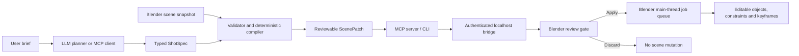

# Architecture

FaceLink separates language understanding from Blender mutation. This is the core product
decision: an LLM is useful for intent and rough staging, but should not own object identity,
threading, undo state or arbitrary code execution.

## Trust boundary

The Blender extension accepts only five operation names: `keyframe_transform`, `look_at`,
`play_clip`, `ensure_camera` and `set_frame_range`. It never accepts Python source or a
generic Blender operator name. The bridge binds to `127.0.0.1`, uses a random bearer token,
limits request bodies to 4 MiB, and routes every `bpy` mutation through a Blender timer on
the main thread.

Successful patches retain up to 50 in-memory FaceLink rollback snapshots. MCP and the Blender
panel use this stack instead of relying on `bpy.ops.ed.undo()`, whose UI-context polling is not
reliable for background or remote bridge jobs. A separate 100-entry audit log is stored on
the Blender Scene and survives `.blend` save/load. Persisted audit entries are never presented
as executable snapshots after a restart.

Rollback history is linear: selecting an older revision restores every newer FaceLink
revision first, followed by the selected revision. Manual edits made after a FaceLink patch
can still be overwritten by its snapshot restore and remain an explicit alpha limitation.

The default v0.2 path has a second safety boundary: the bridge preflights and stages one
patch, Blender displays its operation count, affected objects, frame span and warnings, and
only an explicit apply action mutates the scene. This review gate is provider-independent,
so an MCP client can use its existing model subscription while BYOK users use the CLI.

The v0.2.3 preflight rejects overlapping operations on the same transform/action channel and
FaceLink NLA-strip collisions. Existing editable keyframes are reported as review warnings
instead of hard failures, because overwriting them can be intentional. Staging also builds a
transient GPU overlay from the patch: cyan world-space movement paths and orange predicted
camera frustums. Overlay geometry is kept outside Blender datablocks and is cleared with the
staged patch, so previewing does not dirty or mutate the scene.

Protocol 1.1 adds optimistic scene consistency. The compiler fingerprints scene timing and
the world-space state of only the objects referenced by a patch. Blender checks that value
both when staging and when applying, so an intervening transform, parent, lock or timing edit
cannot be silently overwritten. Unrelated scene edits do not invalidate the patch.

## Why three layers

1. **Core Python package** owns schemas, validation and deterministic compilation. It is
   testable without Blender or an API key.
2. **Blender extension** owns scene identity and mutation. It has no pip dependencies, so it
   installs cleanly through Blender's extension mechanism.
3. **MCP/CLI sidecar** owns model-provider integrations and process communication. API
   dependencies and credentials never need to be embedded in a `.blend` file.

## Compatibility contract

The extension manifest declares Blender 4.2 as minimum and CI should test 4.2 LTS, 4.5 LTS
and the newest stable 5.x release. The code avoids private Blender APIs. Protocol and schema
versions are explicit so clients can negotiate future changes.

## Known MVP constraints

- Object and camera locations are planned in world space and converted to editable local
  channels. Rotation or scale under sheared/non-uniform parent chains still needs a future
  full-matrix solver; armature pose bones are not yet part of this object transform path.
- `play_clip` requires an existing Blender Action with a matching name; motion generation
  and retargeting are out of scope for v0.1.
- Motion paths are straight-line keyframe interpolation, not navigation-mesh or
  collision-aware planning.
- A camera follow uses Blender constraints and remains artist-editable, but sophisticated
  composition and occlusion solving need a later visual evaluator.
